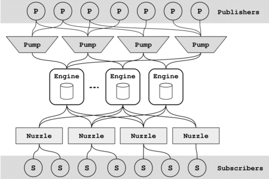

# Firehose: Scalable Publish-Subscribe

## What is Firehose?

Whether to distribute event notifications or to support data streaming across a plethora of devices, publish-subscribe is the go-to paradigm for asynchronous message exchange. 
Messages are sent  through the system, from publishers to subscribers over message channels known as topics, usually guaranteeing delivery even when some nodes within the system have failed.
Designing and implementing such a pub/sub service for extensive scalability and fault-tolerance is a challenging task. 
First, the system should maintain availability even under a number of node failures, regardless of the roles of these nodes. 
Second, the system should scale gracefully and independently in four dimensions: the number of subscribers, publishers, topics, and active topic subscriptions. 
Third, the throughput and latency of the system should not be bottlenecked by disk.
Firehose is a decentralized publish-subscribe system, that accommodates future distributed applications by achieving three primary goals: scalability, low-latency, and sophisticated fault-tolerance, guaranteeing that subscribers receive all messages sent on a topic after they join it.
Internally, Firehose meets these goals by integrating low-overhead state-machine replication directly into the dissemination protocols, implementing staggered topic sharding to maximize availability and making failures more graceful. It also acheives sub-millisecond end-to-end latency through efficient algorithms and non-volatile memory.

### *Extensive documentation and the respective publication are under preparation.*


## People:

Reza Karimi, Gregory Chockler, Ymir Vigfusson


## Organizations: 

Emory University, Atlanta, GA

University of Surrey, England 


## Architecture:

Firehose is comprised of two major parts: a client-side library and a server infrastructure. The client library provides primitives for publishers to create new topics, publish messages to a topic, and for subscribers to subscribe to a topic. The server infrastructure contains three layers each maintains a group of servers. All the components of server infrastructure run within a data center, keeping the option of placing components in different geographical locations due to the decoupled design of the system.

The server infrastructure that runs in the data center includes several components that are responsible for accepting messages from clients, making them persistent for a defined retention period, and forwarding messages to the subscribers which are interested in. To be able to address the scalability requirements, our design has broken the system into multiple decoupled components, enabling independent vertical and horizontal scaling of each component class. Firehose deploys three layers of server infrastructure between publishers and subscribers. *Engines* sit in the middle of the architecture as the main component to accept and forward messages, also maintain topic subscriptions and message replication. *Pumps* accept messages from publishers and forward them to the set of *Engines* responsible for that topic. *Nozzles* are the systems contact-point with subscribers, forward messages to subscribers once receive them from *Engines*.

The figure below demonstrates the architecture of Firehose:



---

## Installing Firehose:


## Evironment

Ubuntu 18.04 or later

## Prequisits:

```
sudo apt install git cmake gcc-10 g++-10 libtbb-dev libasio-dev libconfig++ libboost-all-dev autoconf automake libtool curl make unzip

```

## Install protobuf

On Ubuntu/Debian, you can install them with:

To get the source, download one of the release .tar.gz or .zip packages in the release page:

https://github.com/protocolbuffers/protobuf/releases/latest
For example: if you only need C++, download protobuf-cpp-[VERSION].tar.gz; if you need C++ and Java, download protobuf-java-[VERSION].tar.gz (every package contains C++ source already); if you need C++ and multiple other languages, download protobuf-all-[VERSION].tar.gz.

You can also get the source by "git clone" our git repository. Make sure you have also cloned the submodules and generated the configure script (skip this if you are using a release .tar.gz or .zip package):

```
git clone https://github.com/protocolbuffers/protobuf.git
cd protobuf
git submodule update --init --recursive
./autogen.sh
```

To build and install the C++ Protocol Buffer runtime and the Protocol Buffer compiler (protoc) execute the following:
```
 ./configure
 make
 make check
 sudo make install
 sudo ldconfig # refresh shared library cache.
```


## Build Firehose

Start by cloning firehose and submodules:
```
git clone --recursive https://github.com/SimBioSysLab/firehose.git
cd firehose
mkdir build
cd build
cmake ..
make -j8
```

## Run Firehose

The build phase creates the following executables:
```
engine.x 
pump.x 
nozzle.x 
consumer.x
publisher.x
```

Run the executables with ``` -h ``` option for the parameters info.


---


## License: 
Licensed under the Apache License, Version 2.0. This source-code also uses various third-party components under other open source licenses.  See licenses in the respective subdirectories.


## Disclaimer: 
This SOFTWARE PRODUCT is provided "as is" and "with all faults." THE PROVIDER makes no representations or warranties of any kind concerning the incomplete features, safety, suitability, inaccuracies, typographical errors, or other harmful components of this SOFTWARE PRODUCT. There are inherent dangers in the use of any software, and you are solely responsible for determining whether this SOFTWARE PRODUCT is compatible with your equipment and other software installed on your equipment. You are also solely responsible for the protection of your equipment and backup of your data, and THE PROVIDER will not be liable for any damages you may suffer in connection with using, modifying, or distributing this SOFTWARE PRODUCT.

